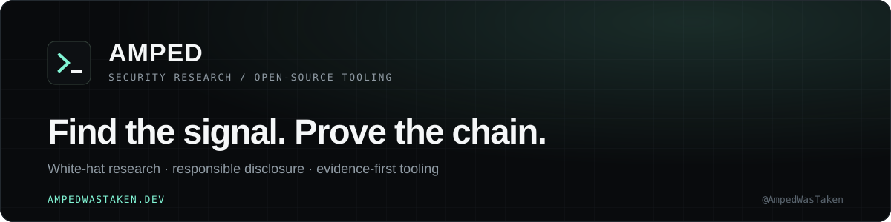

  

  
  
  

  White-hat security research, open-source tooling, and responsible disclosure. 
  Building practical tools around web security, recon, monitoring, and evidence-first validation.

---

### Featured security projects

| Project | Focus |
| --- | --- |
| **[wcdscan](https://github.com/AmpedWasTaken/wcdscan)** | Evidence-first Web Cache Deception scanner |
| **[ReconX](https://github.com/AmpedWasTaken/ReconX)** | Subdomain reconnaissance and service detection |
| **[SecureShield](https://github.com/AmpedWasTaken/secure-shield)** · [site](https://secure-shield.dev) | Security middleware for Node.js |
| **[Honeypot](https://github.com/AmpedWasTaken/Honeypot)** | SSH/FTP honeypot and activity monitoring |
| **[Sentinel-DSTAT](https://github.com/AmpedWasTaken/Sentinel-DSTAT)** | Real-time network traffic monitoring |

  Go · TypeScript / JavaScript · Python · PHP · Next.js

  <strong>More research, tooling, and future disclosures → <a href="https://ampedwastaken.dev">ampedwastaken.dev</a></strong>

